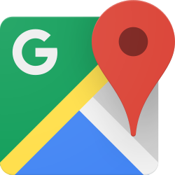
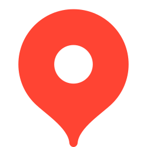

## Активный отдых и море

### Лучшие места для снорклинга

Лучший и самый стабильный снорклинг рядом с Хойаном — это, безусловно, архипелаг Чам Айлендс (Cham Islands). Вода здесь заметно чище, а коралловые рифы более живые и разнообразные. Для выбора подходящего тура (особенно если вы новичок) и комфортного дня рекомендуется отправляться утром, предварительно проверив прогноз ветра. Всегда используйте качественную маску, а не ту, что выдают бесплатно на лодке.

- **Hon Dai (Cham Islands)** — известен прозрачной водой и обилием мелких рифовых рыб; отлично подходит для начинающих.  
- **Hon Mo (Cham Islands)** — более глубокие участки с крупными коралловыми формациями; подходит тем, кто ищет что-то интереснее.  
- **Bai Chong (Cham Islands)** — популярный пляж с хорошим входом в воду; можно совместить снорклинг с отдыхом на берегу.  
- **Bai Xep (Cham Islands)** — небольшой живописный уголок с достаточно богатой морской жизнью.  

### Лучшие места для дайвинга

Для дайвинга в регионе Хойана наиболее разумным выбором являются официальные дайвинг-центры с аккредитацией PADI или SSI, организующие выходы к Чам Айлендс. Именно там условия обычно наиболее предсказуемы в плане видимости, разнообразия морской жизни и, главное, безопасности. Новичкам настоятельно рекомендуется пройти программу Discover Scuba с инструктором, избегая сомнительных «дешёвых пакетов» без чёткой страховки.

- **Cham Island Diving Center** — один из старейших и наиболее уважаемых центров; полный спектр курсов и дейли-дайвов.  
- **Hoi An Diving Center (Blue Coral)** — индивидуальный подход и небольшие группы для более комфортного погружения.  
- **Vietnam Diving (маршруты на Cham Islands)** — исследовательские погружения и уникальные споты.  
- **PADI-центры из Хойана** — актуальный список на официальном сайте PADI; гарантирует соблюдение международных стандартов.

### Лучшие места для серфинга

Серфинг в регионе Хойана сильно зависит от сезона. Наилучшие волны обычно приходят в период северо-восточных свеллов (примерно с сентября по март), тогда как летом условия могут быть спокойнее. Новичкам проще всего начать на широких песчаных пляжах Дананга, воспользовавшись услугами инструктора и мягкой доской.

- **My Khe Beach (Дананг)** — мягкие ровные волны, идеальны для обучения; много школ серфинга.  
- **Non Nuoc Beach (Дананг)** — более стабильные волны для серферов среднего уровня, особенно в высокий сезон.  
- **Man Thai Beach (Дананг)** — менее людный пляж с хорошими условиями в правильный свелл.  
- **An Bang Beach (Хойан)** — в основном для спокойных тренировок и изучения азов в дни с небольшими волнами.  

### Лучшие места для SUP (Stand Up Paddleboarding)

Для занятий SUP в Хойане лучше всего подходит раннее утро: ветер минимален, вода чище и спокойнее. Если нужен живописный маршрут, сочетайте открытое море со спокойными участками реки или лагуны.

- **An Bang Beach (утро)** — идеален для старта: спокойная вода и безопасная прибрежная зона.  
- **Cua Dai Beach (в тихую погоду)** — более открытое пространство, но нужна спокойная погода из-за возможного волнения.  
- **Thu Bon River (спокойные участки)** — мангровые заросли и деревни, защищены от ветра.  
- **SUP Hoi An** — прокат досок, организованные туры и уроки для всех уровней.  

### Где арендовать лодку или яхту

В районе Хойана преимущественно доступны частные лодки, скоростные катера (speedboat) и форматы дневных круизов. Полноценные «яхты» с маринами и полным сервисом чаще всего проще искать через Дананг. Крайне важно перед оплатой уточнить все детали: включено ли топливо, предоставляются ли спасательные жилеты, есть ли страховка пассажиров и что именно подразумевается под «дополнительными часами».

- **Cua Dai Pier (локальные лодки на день)** — основное место для однодневных поездок к близлежащим островам или по реке.  
- **Частные boat-операторы на Cham Islands** — индивидуальные туры, бронирование на месте или через агентства.
- **Danang Marina / операторы day cruise** — аренда более крупных судов и полноценные морские прогулки или рыбалка.  
- **Проверенные реселлеры через отель/консьержа с фикс-прайсом** — готовые решения и прозрачная цена без торга.
