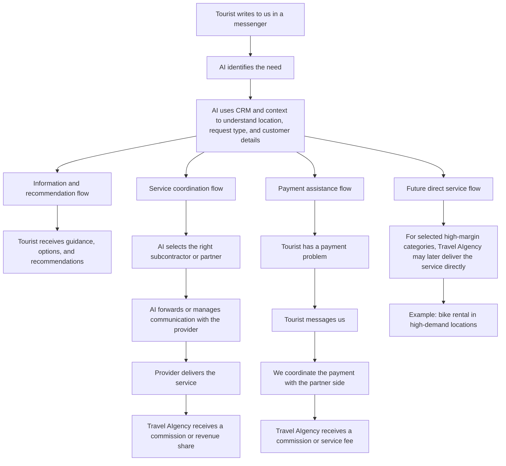

# Travel AIgency Business Plan

## 5. How the Business Works

Travel AIgency does not operate through only one linear flow. It works through several operating paths depending on the tourist's request.

### Operating chart

### Key logic

- The tourist communicates with Travel AIgency, not directly with multiple local providers
- The AI sits between the tourist and the partner network and manages two-sided communication
- The system routes requests based on customer context, location, and service type
- Different requests can lead to recommendation, coordination, payment support, or future direct fulfillment
