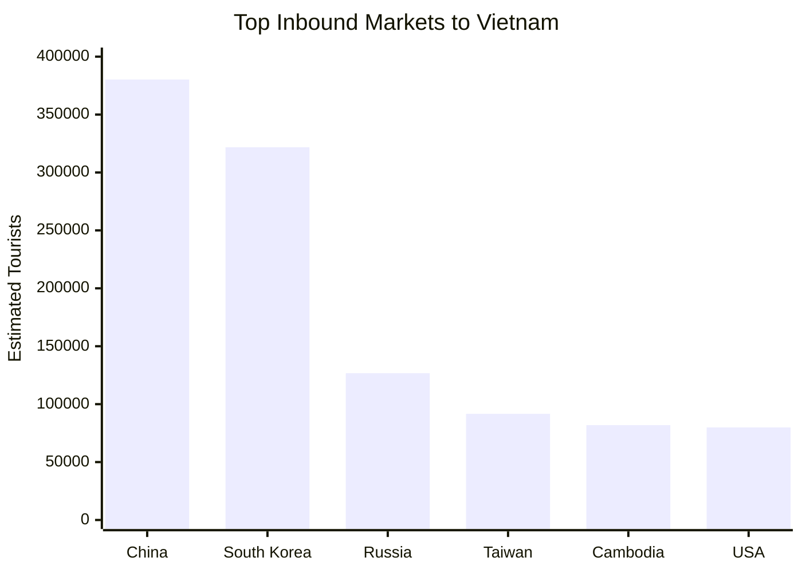

# Travel AIgency Business Plan

## 6. Market Size

This section summarizes the incoming tourist flow using the provided CSV files.

The figures below are based on the June 2026 route and passenger datasets, plus the annual airport distribution datasets.

### Direct Flights to Da Nang

Estimated June 2026 direct routes to Da Nang from Russian-speaking countries:

| Departure City | Country | Flights in June | Seats per Month | Estimated Passengers |
| --- | --- | --- | --- | --- |
| Astana | Kazakhstan | 26 | 6,773 | 5,994 |
| Almaty | Kazakhstan | 17 | 2,844 | 2,462 |
| Tashkent | Uzbekistan | 9 | 1,989 | 1,791 |
| Vladivostok | Russia | 3 | 660 | 627 |
| Moscow | Russia | 2 | 480 | 456 |
| Kazan | Russia | 2 | 440 | 418 |
| Khabarovsk | Russia | 2 | 440 | 418 |
| Krasnoyarsk | Russia | 2 | 440 | 418 |
| Novosibirsk | Russia | 2 | 440 | 418 |
| Barnaul | Russia | 1 | 220 | 209 |
| Blagoveshchensk | Russia | 1 | 220 | 209 |
| Novokuznetsk | Russia | 1 | 220 | 209 |
| Minsk | Belarus | 1 | 220 | 220 |
| **Total** |  | **69** | **15,386** | **13,849** |

These direct flights to Da Nang can be monitored almost in real time using arrival boards and flight logs.

### Russian-Speaking Tourist Flow Across Vietnam

Estimated June 2026 direct flow into Vietnam from Russian-speaking countries based on the provided route files:

| City | Country | Flights in June | Flights per Week | Estimated Passengers |
| --- | --- | --- | --- | --- |
| Moscow | Russia | 38 | 8.7 | 10,959 |
| Astana | Kazakhstan | 48 | 11.0 | 8,321 |
| Tashkent | Uzbekistan | 26 | 6.0 | 5,290 |
| Novosibirsk | Russia | 14 | 3.2 | 3,272 |
| Almaty | Kazakhstan | 21 | 4.8 | 3,036 |
| Vladivostok | Russia | 11 | 2.5 | 2,457 |
| Khabarovsk | Russia | 7 | 1.6 | 1,531 |
| Kazan | Russia | 7 | 1.6 | 1,459 |
| Krasnoyarsk | Russia | 7 | 1.6 | 1,459 |
| Ekaterinburg | Russia | 7 | 1.6 | 1,443 |
| Barnaul | Russia | 5 | 1.2 | 1,096 |
| Minsk | Belarus | 5 | 1.2 | 1,045 |
| Novokuznetsk | Russia | 4 | 0.9 | 870 |
| Blagoveshchensk | Russia | 4 | 0.9 | 870 |
| Irkutsk | Russia | 3 | 0.7 | 678 |
| Tomsk | Russia | 2 | 0.5 | 452 |
| **Total** |  | **209** | **48.1** | **44,238** |

This table reflects the broader Russian-speaking inbound market rather than only flights from Russian cities.

### Broader Estimate of Total Russian Arrivals by Channel

The direct-air analysis captures only one part of the total Russian tourist flow. A broader market estimate should also include connecting traffic and land entry.

| Channel | Explanation | Est. Russian Pax (June) |
| --- | --- | --- |
| Direct charter flights (Anex/Azur Air/Red Wings to DAD, CXR, SGN, PQC) | What our analysis captured | ~28,000 |
| Scheduled flights direct (Aeroflot SGN, VN Airlines HAN) | Also captured | ~7,000 |
| Connecting via Bangkok/Seoul/Dubai | Not captured in the direct-air model | ~40,000-50,000 |
| Connecting via Chinese hubs | Flights via Guangzhou and Shanghai not in our analysis | ~20,000-25,000 |
| Land border crossings | Cambodia-Vietnam and China border flows | ~15,000-20,000 |
| Other Vietnamese airports (Hue, Chu Lai, Vinh and others) | Not included in the 5-airport model | ~5,000 |

This table helps show that the real Russian-speaking addressable market is materially larger than the direct-flight dataset alone.

### Annual Distribution by Vietnam Entry Airport

Annual airport distribution from the provided summary files:

| Airport | Annual Passengers | Share | Peak Season |
| --- | --- | --- | --- |
| 🏖 Nha Trang (CXR) | 120,289 | 27.9% | Year-round (summer peak) |
| 🏙 Ho Chi Minh City (SGN) | 94,008 | 21.8% | Stable year-round |
| 🏄 Da Nang (DAD) | 86,037 | 20.0% | Summer only (Jun-Oct) |
| 🏛 Hanoi (HAN) | 66,668 | 15.5% | Moderate year-round |
| 🌴 Phu Quoc (PQC) | 63,784 | 14.8% | Winter only (Oct-Apr) |
| Total | 430,786 | 100% |  |

This annual distribution helps show where the broader Russian-speaking tourist flow is concentrated over time.

### Research Chart: CIS and Russia Arrivals by Source City

This chart shows that Moscow is the largest single source city, followed by Astana and Tashkent, while Novosibirsk, Vladivostok, Khabarovsk, Krasnoyarsk, Kazan, and Ekaterinburg form the next meaningful group of source cities.

This is important for city-level targeting, route monitoring, and media buying.

### Research Chart: Monthly Arrivals by Vietnam Airport

This chart gives a strong visual explanation of seasonality by destination inside Vietnam:

- Da Nang peaks in summer
- Nha Trang stays strong across most of the year
- Ho Chi Minh City is more stable
- Hanoi remains moderate and steady
- Phu Quoc shifts toward the winter season

This seasonality view is important for launch planning, staffing, marketing budget allocation, and deciding which destinations to prioritize at different times of the year.

### Other Possible Countries for Future Expansion

This table is useful for expansion strategy beyond the initial Russian-speaking focus.

| # | Country | Region | Est. Tourists | Share |
| --- | --- | --- | --- | --- |
| 1 | 🇨🇳 China | Asia | 380,250 | 19.5% |
| 2 | 🇰🇷 South Korea | Asia | 321,750 | 16.5% |
| 3 | 🇷🇺 Russia | Europe/CIS | 126,750 | 6.5% |
| 4 | 🇹🇼 Taiwan | Asia | 91,650 | 4.7% |
| 5 | 🇰🇭 Cambodia | Asia | 81,900 | 4.2% |
| 6 | 🇺🇸 USA | Americas | 79,950 | 4.1% |
|  | Total |  | 1,082,250 | 55.5% of total |

### Future Expansion Strategy Chart

