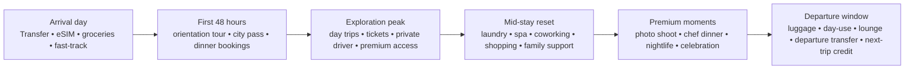

# Revenue Sources and ARPU Expansion for On-Destination Travel Operators

## Executive summary

The largest **dollar** revenue pools in public travel distribution still come from accommodation-related merchant and agency economics. Booking Holdings reported **$26.9 billion** of 2025 revenue, split across **merchant revenues of $17.8 billion**, **agency revenues of $8.0 billion**, and **advertising and other revenues of $1.2 billion**; Booking also states that about **89%** of its revenue relates to online accommodation reservation services. Expedia Group reported **$14.7 billion** of 2025 revenue, with **70% merchant**, **22% agency**, and **8% advertising/media/other**, while **lodging accounted for 80%** of revenue. In other words, the most popular travel revenue source remains the same basic engine: commissions and margins on core travel inventory, especially stays, plus adjacent ancillaries layered around that trip. citeturn29view0turn28view1

The most attractive **growth** and often **profitability** pools, however, are increasingly in the layers around the booking rather than the room alone: **subscriptions, experiences, passes/tickets, payments, insurance/protection, dining/media, and operationally light convenience products**. eDreams ODIGEO said that around **87% of its cash marginal profit** comes from Prime and has repeatedly guided to roughly **€80 Prime ARPU**, showing how recurring travel membership can out-earn classic OTA economics. Tripadvisor reported that **Viator** reached about **$4.7 billion GBV in 2025** with **$91 million adjusted EBITDA** and that marketplace businesses represented **61% of group revenue** and **35% of adjusted EBITDA**; TheFork reached **9.2% adjusted EBITDA margin** in 2025. Meanwhile, Arival and Phocuswright estimate the experiences market reached roughly **$271 billion in 2025** and is expected to exceed **$340 billion by 2029**, with OTAs growing from **under $8 billion** in experience gross bookings in 2019 to **more than $40 billion** by 2029. citeturn8search0turn30search2turn33search9turn33search7turn10search12turn10search18

For traditional travel agencies, the evidence points to a dual model: **commissions/overrides remain the classic base**, but **professional fees are increasingly necessary and accepted**. Phocuswright’s U.S. agency work says commissions and overrides still dominate agency revenue streams, while Travel Weekly reported that **more than half of U.S. advisors now charge fees**. WTAAA’s 2025 white paper, drawing on ASTA guidance, directly links the rise of fees to commission pressure and notes that most major airlines eliminated base commissions long ago. citeturn38search4turn16search1turn17search17turn16search0

For an operator who is **already on-destination and in regular contact with the tourist**, the optimal ARPU strategy is not to chase one big upsell. It is to build a **connected-stay monetization stack**: capture the arrival, convert the first 48 hours, sell one or two “anchor” experiences, repeatedly monetize convenience during the middle of the stay, then monetize the departure and seed the next trip. This is exactly where public-market evidence and traveler behavior line up: Booking keeps emphasizing the “connected trip,” experiences booking windows are short, and travelers repeatedly discuss pain points around laundry, luggage, connectivity, photos, tours, and dead time before flights. Roughly **one-third** of travelers book tours/activities **the same day**, and roughly **three in four** book within **one week** of arrival; separately, **65%** of travelers say experiences play a significant role in destination choice. citeturn28view4turn19search9turn10search1turn26search0turn26search3turn13search0turn14search8turn23search8

The practical conclusion is straightforward: if you own the relationship during a 10-day stay, the highest-impact ARPU levers are usually **arrival transfers, eSIM/connectivity, attraction passes/ticketing, dinner reservations, tours, private transport, laundry/luggage/day-use, spa/recovery, messaging-based concierge, and partner marketplace economics**. Official products already exist for nearly all of these categories — city passes, day-use rooms, lounge access, luggage storage, airport transfers, tourist eSIMs, vacation photographers, and Airbnb-style local services — which lowers development risk because the demand pattern is proven. citeturn12search3turn12search4turn12search14turn24search0turn24search1turn24search2turn37search0turn34search1turn35search2turn18search0turn18search12

## What the market evidence says about travel monetization

A useful way to read the travel industry is to separate **popular**, **profitable**, and **feasible** revenue pools. Popularity means what sells most often or produces the biggest absolute revenue. Profitability means what tends to create the highest incremental contribution after supplier cost. Feasibility means what an on-destination operator can launch quickly without becoming a hotel, airline, or regulated insurer. Public filings and industry reports show that those are not the same thing. citeturn29view0turn28view1turn17search4turn10search12

| Business model | Most popular revenue sources | Most profitable or strategically attractive pools | Why it matters for you |
|---|---|---|---|
| Travel agencies | Commissions/overrides on hotels, packages, tours, cruises; planning/service fees; insurance and admin help | Fees, niche expertise, insurance/protection, bundled planning, repeat-client membership/retainer-like economics | You can imitate the fee logic with paid concierge, itinerary review, reservation handling, and premium support. citeturn38search4turn16search1turn17search17 |
| OTAs | Merchant lodging, agency commissions, packaged travel, flights/cars | Subscriptions, advertising/media, experiences, payment facilitation, insurance, B2B/API distribution, restaurant/ticketing SaaS | You should borrow the OTA playbook: connected-trip bundles, repeated in-stay nudges, marketplace margin, and add-ons with low service cost. citeturn29view0turn28view1turn8search0turn33search9turn25search11 |
| On-destination operator | Transfers, tours, tickets, dining help, logistics | Messaging concierge, net-rate local inventory, passes/ticketing, laundry/luggage/day-use, recurring credits/memberships, sponsor placements | This is the sweet spot because you already have the traveler’s attention while the spend decision is still being made. citeturn10search1turn24search0turn24search2turn37search0turn36search1 |

The on-destination opportunity is unusually strong because travelers often do **not** lock everything in before arrival. Arival/Phocuswright data show short booking windows for experiences, while official operators show a broad menu of “micro-products” that can be sold during the trip: **Lisboa Card**, **Berlin WelcomeCard**, and **Paris Museum Pass** bundle transport, access, and discounts; **Dayuse** legitimizes day rooms; **Priority Pass** and related operators sell lounge access and pre-booking; **Bounce/Nannybag** normalize paid luggage storage; **Welcome Pickups** institutionalizes airport and city transfers; **A1** and **Viettel** sell tourist eSIM/plans tailored to short stays; **Flytographer** productizes the vacation photo shoot; and Airbnb’s official releases show services like grocery delivery, airport pickups, car rentals, and in-stay services moving directly into the trip flow. citeturn10search1turn12search3turn12search4turn12search14turn24search0turn24search1turn24search2turn37search0turn34search1turn34search0turn35search2turn18search0turn18search12

Traveler discussions reinforce the same pattern. Forum and Reddit threads repeatedly surface laundry on longer trips, what to do with luggage before check-in or after checkout, how to get a local SIM/eSIM, whether food tours are “worth it,” whether airport transfers are reliable, and how solo travelers get good photos. Those are exactly the kinds of problems that travelers solve with money when the option is simple and trusted. citeturn13search0turn14search16turn14search8turn14search10turn23search3turn23search8turn23search1



The timeline above reflects the most monetizable windows in a 10-day stay: urgent logistics at arrival, anchoring experiences in the first two days, repeated convenience monetization in the middle, and departure optimization at the end. That sequence is supported by short booking windows for experiences, official availability of in-stay services, and the connected-trip emphasis in OTA strategy. citeturn10search1turn24search0turn24search2turn37search0turn28view4

## Scoring model and category summary

All scores below are **directional operating estimates**, not destination-specific forecasts. I assumed **no specific destination constraint** and a generic leisure tourist staying about 10 days. Revenue bands represent **net revenue captured by you per tourist**, not gross end-customer spend. Margin bands are estimated **gross margin**. A “high” legal/regulatory score means that licensing, ticketing rules, transport regulation, insurance distribution, childcare, medical referral rules, or consumer-protection issues should be checked locally before launch. citeturn16search0turn17search17turn29view0

**Band definitions**

| Metric | Low | Medium | High |
|---|---|---|---|
| Revenue per tourist | under $15 | $15–$60 | over $60 |
| Gross margin | under 25% | 25%–55% | over 55% |
| Complexity | launchable with simple partner workflow | needs moderate ops/software/training | needs deep ops, staffing, or licensing |
| Legal/reg risk | routine commerce | some contractual/compliance review | regulated or locally sensitive |
| Seasonality | weakly seasonal | moderate seasonality | strongly weather/event dependent |
| Scalability | hard to repeat without labor | moderate | highly repeatable and automatable |
| Fit for 10-day stay | weak | moderate | strong |

**Profile legend used in the full inventory**

| Profile | RT | Rev | GM | Cx | Legal | Seas | Scale | 10D | Typical uses |
|---|---|---:|---:|---:|---:|---:|---:|---:|---|
| P1 | one-time / markup / commission | L | H | L | L | L | H | H | eSIM, adapters, maps, QR wallet, digital setup |
| P2 | one-time / markup | M | M | M | M | L | M | H | core arrival/departure logistics |
| P3 | one-time / markup | H | H | M | M | L | M | H | VIP arrival, fast-track, premium access |
| P4 | one-time / markup | H | M | M | H | M | M | H | private transport, day drivers, rentals |
| P5 | one-time / commission | M | H | L | M | M | H | H | restaurant covers, passes, standard ticketing |
| P6 | one-time / markup / commission | M | H | M | M | M | M | H | tours, classes, inner-city experiences |
| P7 | one-time / markup / commission | M/H | M | H | H | H | L | M | outdoor and adventure products |
| P8 | one-time / commission / markup | M | H | M | M/H | L | M | H | spa, salon, massage, recovery |
| P9 | one-time / commission / markup | M | M | H | H | M | M | M | childcare, family support, care-heavy service |
| P10 | one-time / commission / markup | H | H | M | M | M | M | M | photography, proposals, romance premium |
| P11 | one-time / markup / commission | M | H | L | M | L | H | H | laundry, luggage, day-use, room-linked convenience |
| P12 | one-time / markup / commission | M/H | H | L | M | M/H | H | H | passes, events, timed-entry, VIP ticketing |
| P13 | subscription / recurring | L/M | H | M | M | L | H | H | memberships, points, travel credits, passes |
| P14 | recurring / subscription / ad | L/M | H | L | M | L | H | H | chat concierge, content, alerts, sponsor placements |
| P15 | commission / markup / recurring | H | H | M | M | L/M | H | H | managed marketplace, net rates, B2B2C economics |
| P16 | one-time / commission / markup | L/M | H | M | H | L | M | H | protection, insurance, safety/medical routing |
| P17 | one-time / markup / commission | L/M | H | M | M/H | M | H | M | retail, shipping, procurement, souvenirs |
| P18 | one-time / commission / donation | L | M | M | L/M | M | M | M | sustainability, dispersal, impact add-ons |

**Category summary**

| Category | Count |
|---|---:|
| Arrival, departure and travel admin | 25 |
| Connectivity, payments and digital convenience | 25 |
| Local mobility and ground transport | 25 |
| Core tours and sightseeing | 25 |
| Food, drink and nightlife | 25 |
| Nature, sport and adventure | 25 |
| Culture, classes and maker experiences | 25 |
| Wellness, beauty and recovery | 25 |
| Family, kids and multigenerational support | 25 |
| Romance, celebration and photography | 25 |
| Shopping, souvenirs and local commerce | 25 |
| Premium access, queue-jumps and VIP support | 25 |
| Workation, productivity and extended-stay support | 25 |
| Accommodation-adjacent convenience services | 25 |
| Events, tickets and timed-entry orchestration | 25 |
| Safety, health and problem-solving | 25 |
| Community, loyalty and membership | 25 |
| Remote concierge, AI nudges and content monetization | 25 |
| Partner-led B2B2C monetization while keeping traveler contact | 25 |
| Sustainability, impact and place-based giving | 25 |
| **Total** | **500** |

## Highest-impact ideas

These 50 rank highest because they combine some mix of **near-universal attach rate**, **repeatable or bundleable usage across a 10-day stay**, **high or medium gross margins**, **manageable complexity**, and/or **marketplace-style economics** that compound without needing you to own all supply. The ranking is a strategic model built from OTA filings, agency economics, experience-booking behavior, official product analogs, and traveler pain points. citeturn29view0turn28view1turn8search0turn10search1turn17search17turn24search0turn34search1

| Rank | Code | Idea | RT | Rev | GM | Cx | Partners | Legal | Seas | Scale | 10D |
|---:|---|---|---|---|---|---|---|---|---|---|---|
| 1 | A02 | Airport transfer + on-arrival eSIM activation bundle | one-time + markup | M | M | L | drivers, telco/eSIM | M | L | H | H |
| 2 | R01 | WhatsApp concierge that sells daily upgrades | recurring + commission/markup | M | H | L | CRM, all local suppliers | M | L | H | H |
| 3 | S03 | Negotiate net rates on tours and resell with markup | markup | H | H | M | tour operators | M | M | H | H |
| 4 | D01 | Small-group city highlights walk on first full day | one-time + markup | M | H | M | guides | M | M | M | H |
| 5 | O01 | Attraction city pass with your margin or commission | commission/markup | M | H | L | DMOs, attractions | M | M | H | H |
| 6 | E04 | Dinner reservation concierge with preferred seating | commission | M | H | L | restaurants | L/M | L | H | H |
| 7 | N16 | Laundry pickup and return within 24 hours | markup/commission | M | H | L | laundries, courier | M | L | H | H |
| 8 | A01 | Prepaid airport transfer with guaranteed wait time | one-time + markup | M | M | L | drivers | M | L | H | H |
| 9 | B01 | Destination-specific eSIM with instant QR activation | one-time + markup | L | H | L | telco/eSIM | L | L | H | H |
| 10 | D23 | Same-day micro-tour for spontaneous travelers | one-time + markup | M | H | M | guides | M | M | M | H |
| 11 | C02 | Private car + driver by the half day | one-time + markup | H | M | M | chauffeurs | H | M | M | H |
| 12 | A07 | Sell return airport transfer while the guest is arriving | one-time + markup | M | M | L | drivers | M | L | H | H |
| 13 | N02 | Day-use room for late departures | markup/commission | M | H | L | hotels, day-use platforms | M | L | H | H |
| 14 | L01 | Attraction fast-track tickets where available | commission/markup | M | H | L | attractions | M | M | H | H |
| 15 | S04 | Restaurant cover commission or prepaid dining share | commission | M | H | L | restaurants | L/M | L | H | H |
| 16 | E01 | Small-group street food tour | one-time + markup | M | H | M | guides, food vendors | M | M | M | H |
| 17 | H01 | Massage appointments with transport included | commission/markup | M | H | M | spas, therapists, drivers | M/H | L | M | H |
| 18 | O07 | Timed-entry reservation management service | commission/markup | M | H | L | attractions, ticketing | M | M | H | H |
| 19 | C03 | Private car + driver by the full day | one-time + markup | H | M | M | chauffeurs | H | M | M | H |
| 20 | J01 | Vacation photo shoot with local photographer | commission/markup | H | H | M | photographers | M | M | M | M |
| 21 | L19 | Line-skip + guide + transfer complete package | markup | H | H | M | attractions, guides, drivers | M | M | M | H |
| 22 | O23 | Ticket insurance / refund protection where legal | commission | L/M | H | M | insurers, ticketing partners | H | L | H | H |
| 23 | A05 | Airport fast-track immigration add-on | one-time + markup | H | H | M | airport service providers | M/H | L | M | H |
| 24 | N04 | Late checkout buyout with partner hotels | markup/commission | M | H | L | hotels | M | L | H | H |
| 25 | E05 | Prepaid tasting-menu packages at partner restaurants | commission/markup | M | H | L | restaurants | M | L | H | H |
| 26 | H03 | Spa day passes | commission/markup | M | H | L | spas, beach clubs | M | L | H | H |
| 27 | S21 | Ad placements in your guest chat/app to local venues | recurring + markup | M | H | L | local venues | M | L | H | H |
| 28 | S22 | Sponsored itinerary positions for qualified partners | recurring + markup | M | H | L | local operators | M | L | H | H |
| 29 | Q01 | Stay-only premium concierge membership | subscription | M | H | M | CRM, perks partners | M | L | H | H |
| 30 | R04 | Weather-triggered upsells and indoor alternatives | recurring + markup | M | H | L | CRM, indoor suppliers | M | L | H | H |
| 31 | S18 | Commissionable experience desk inside accommodations | commission + recurring | H | H | M | hotels, rentals, operators | M | L | H | H |
| 32 | S10 | Laundry-service commission or fixed-fee share | commission | M | H | L | laundries | M | L | H | H |
| 33 | J02 | Surprise proposal planning service | markup | H | H | M | photographers, venues, florists | M | M | M | M |
| 34 | A21 | Departure lounge access bundled with transfer | commission/markup | M | M/H | L | lounge operators, drivers | M | L | H | H |
| 35 | B12 | Split-pay / pay-later on high-ticket tours | commission/markup | L/M | H | M | BNPL, tour operators | M/H | L | H | H |
| 36 | O03 | Live music tickets with transfer add-on | commission/markup | M | H | L | venues, ticketing, drivers | M | M | H | H |
| 37 | E24 | Nightclub guest-list or table-booking service | commission/markup | H | H | M | clubs, promoters | M/H | M | M | M |
| 38 | P01 | Travel insurance / activity protection where licensed | commission | L/M | H | M | insurers | H | L | M | H |
| 39 | H24 | Post-adventure recovery package | markup | M | H | M | spas, nutrition, wellness | M/H | L | M | H |
| 40 | C22 | Event-night surge-proof transfer pricing | markup | M | M | M | drivers | H | M | M | H |
| 41 | O25 | Return-visit future event presale rights | recurring/subscription | L/M | H | M | venues, CRM | M | M | H | M |
| 42 | R18 | QR codes around accommodation linking to upsells | recurring + commission/markup | M | H | L | accommodations, operators | M | L | H | H |
| 43 | B24 | AI trip chat assistant premium tier | subscription/recurring | L/M | H | M | AI stack, CRM | M | L | H | H |
| 44 | Q03 | Ten-day all-access micro-membership | subscription | M | H | M | multiple perks partners | M | L | H | H |
| 45 | A25 | Emergency delayed-bag essentials delivery kit | markup | M | H | L | retail, courier | L/M | L | H | H |
| 46 | E17 | Private chef dinner in villa or apartment | markup | H | H | M | chefs, rentals | M/H | L | M | M |
| 47 | L02 | Hard-to-book museum/reservation concierge | commission/markup | M | H | L | museums, ticketing | M | M | H | H |
| 48 | S24 | Charge partners for priority inventory distribution | recurring | M | H | L | local suppliers | M | L | H | H |
| 49 | R03 | Personalized daily itinerary refreshes | recurring | M | H | L | CRM, concierge staff | M | L | H | H |
| 50 | Q16 | Book-now-use-later credits for next trip | recurring / stored-value | M | H | M | payment stack, partners | M | L | H | M |

The pattern in the table is the real takeaway: the best ideas are not necessarily the grandest experiences. They are the ones that combine **trust**, **timing**, **simple fulfillment**, and **repeatability**. Arrival logistics convert because they remove uncertainty. Convenience services convert because they solve hassle. Ticketing and passes convert because they reduce friction. Messaging and memberships win because they let you keep selling without forcing the traveler to leave the channel you already control. citeturn10search1turn28view4turn24search0turn24search2turn37search0

## Full idea inventory

The 500 ideas below are organized by category. Each line maps to one or more **profiles** from the scoring table above, which encode **revenue type, revenue band, gross margin, complexity, legal risk, seasonality, scalability, and 10-day-stay fit**. The only item-specific field written out individually is **required partnerships/suppliers**, because that is the dimension that changes most from idea to idea. The mix of ideas is grounded in OTA/agency revenue disclosures, official product analogs, and traveler-stated pain points. citeturn29view0turn28view1turn8search0turn10search12turn12search3turn24search0turn24search2turn35search2turn13search0turn14search8

**Arrival, departure and travel admin**

```text
A01 ★ Prepaid airport transfer with 60-minute wait time — P2 | Partners: drivers, airport-transfer platform
A02 ★ Airport transfer + on-arrival eSIM activation bundle — P2+P1 | Partners: drivers, telco/eSIM
A03 Shared shuttle seats timed to major flight banks — P2 | Partners: shuttle operators
A04 VIP arrival meet-and-greet at terminal exit — P3 | Partners: airport assist providers
A05 ★ Airport fast-track immigration add-on — P3 | Partners: airport fast-track suppliers
A06 Porter service for families or elderly travelers — P2 | Partners: airport assist providers
A07 ★ Return airport transfer sold at arrival — P2 | Partners: drivers
A08 Arrival grocery or pantry starter-pack delivery — P11 | Partners: grocers, couriers
A09 First-night food delivery timed to check-in — P11 | Partners: restaurants, couriers
A10 Luggage delivery from airport to accommodation — P11 | Partners: luggage couriers
A11 Bike/sports-gear transfer from airport to hotel — P11 | Partners: logistics couriers
A12 Visa-photo / printing / onward-document help — P1 | Partners: print shops, couriers
A13 Onward boarding-pass print and document-check service — P1 | Partners: print shops
A14 Seamless ferry/rail/coach transfer from airport — P2 | Partners: transfer operators, rail/ferry sellers
A15 Overnight transit hotel or day-room for odd arrivals — P11 | Partners: hotels, day-use platforms
A16 Child-seat guaranteed airport transfer — P2 | Partners: drivers, child-seat vendors
A17 Pet-friendly airport transfer — P2 | Partners: pet-friendly drivers
A18 Multilingual arrival hotline for lost-driver issues — P14 | Partners: call-center/concierge staff
A19 Premium departure transfer with luggage assistance — P3 | Partners: drivers, porters
A20 Departure fast-track/security escort add-on — P3 | Partners: airport assist providers
A21 ★ Departure lounge access + transfer bundle — P2+P12 | Partners: lounge operators, drivers
A22 Tax-refund paperwork support — P1 | Partners: tax-refund desks, admin staff
A23 Baggage wrap / baggage protection add-on — P11 | Partners: airport retail, wrap kiosks
A24 Early check-in holding package with breakfast stop — P11 | Partners: cafes, drivers, luggage storage
A25 ★ Emergency delayed-bag essentials delivery kit — P11 | Partners: pharmacies, retail, couriers
```

**Connectivity, payments and digital convenience**

```text
B01 ★ Destination-specific eSIM with instant QR activation — P1 | Partners: telco/eSIM wholesalers
B02 Physical tourist SIM delivered to accommodation — P1 | Partners: telcos, couriers
B03 Top-up service for tourist SIMs mid-stay — P1 | Partners: telcos
B04 eSIM bundled with WhatsApp concierge access — P1+P14 | Partners: telcos, CRM stack
B05 Portable Wi-Fi rental with hotel delivery — P1 | Partners: device-rental vendors
B06 Charging kits and universal-adapter rental — P1 | Partners: device-rental vendors
B07 Power-bank rental with pickup/drop-off points — P1 | Partners: device vendors, retail hosts
B08 Cashless transit cards preloaded for first days — P1+P5 | Partners: transit card issuers
B09 Foreign-exchange delivery to accommodation — P1 | Partners: FX providers
B10 Small-value emergency cash advance for verified guests — P16 | Partners: payment/fintech partners
B11 Multi-language digital city guide upsell — P1 | Partners: content creators
B12 ★ Pay-later / split-pay on high-ticket tours — P15 | Partners: BNPL providers, tour operators
B13 Digital tipping wallet for guides and drivers — P1 | Partners: payment providers
B14 Expense-receipt consolidation for business travelers — P14 | Partners: expense software
B15 Help for apps that require domestic cards — P1 | Partners: fintech, app partners
B16 QR-ticket wallet setup for attractions and transit — P1 | Partners: ticketing and transit sellers
B17 Mobile-number activation help for OTP-dependent apps — P1 | Partners: telco staff
B18 Translation hotline / live interpreter minutes — P14 | Partners: interpreters
B19 Roaming troubleshooting or phone-setup service — P1 | Partners: device/telco support
B20 Photo-storage cloud voucher for heavy-content travelers — P1 | Partners: cloud vendors
B21 Local streaming/sports-access helper package — P1 | Partners: content platforms where lawful
B22 Smart itinerary app with live schedule sync — P14 | Partners: itinerary software
B23 AI trip chat assistant in standard tier — P14 | Partners: AI stack, CRM
B24 ★ AI trip chat assistant premium tier — P14+P13 | Partners: AI stack, payment stack
B25 Secure eSIM + VPN setup pack for workation guests — P1 | Partners: telco, VPN vendors
```

**Local mobility and ground transport**

```text
C01 24-hour hop-on city transfer service with fixed routes — P2 | Partners: shuttle operators
C02 ★ Private car + driver by the half day — P4 | Partners: chauffeur firms
C03 ★ Private car + driver by the full day — P4 | Partners: chauffeur firms
C04 Scooter rental with insurance and helmet delivery — P4 | Partners: rental shops, insurers
C05 Bicycle rental with curated route maps — P4 | Partners: bike shops
C06 E-bike rental with delivery and collection — P4 | Partners: bike shops
C07 Ride-credit bundles with local taxi app — P1+P5 | Partners: ride-hailing apps
C08 Intercity transfer to nearby towns/attractions — P4 | Partners: driver networks
C09 Premium minivan for groups with luggage — P4 | Partners: van operators
C10 Wheelchair-accessible vehicle bookings — P4 | Partners: accessible transport suppliers
C11 Ferry ticket plus dock-transfer bundle — P5+P2 | Partners: ferry sellers, drivers
C12 Chauffeur for nightlife return rides — P4 | Partners: drivers, nightlife venues
C13 Multi-stop shopping transfer package — P4 | Partners: drivers, retail partners
C14 Sunrise/sunset transfer to scenic viewpoints — P4 | Partners: drivers
C15 Picnic transfer to beach/park with cooler add-on — P4 | Partners: drivers, rental vendors
C16 Child-friendly family transfer with booster seats — P4 | Partners: family transport suppliers
C17 Luggage-forwarding between accommodations — P11 | Partners: luggage couriers
C18 Rail-station transfer + platform support — P2 | Partners: station transfer providers
C19 Self-drive car rental with local-rules briefing — P4 | Partners: car-rental firms
C20 Motorcycle rental with safety briefing — P4 | Partners: rental shops
C21 Boat taxi or water-shuttle add-on — P4 | Partners: boat operators
C22 ★ Event-night surge-proof transfer pricing — P4 | Partners: drivers
C23 Photo-route transfer with stops at viewpoints — P4+P10 | Partners: drivers
C24 Cross-border day-trip transport package — P4 | Partners: licensed transport operators
C25 Backup transport guarantee for missed connections — P2+P16 | Partners: transport providers
```

**Core tours and sightseeing**

```text
D01 ★ Small-group city highlights walk on first full day — P6 | Partners: guides
D02 Private customized half-day city orientation tour — P6 | Partners: private guides
D03 Private customized full-day city orientation tour — P6 | Partners: private guides
D04 Themed neighborhood walks by traveler interest — P6 | Partners: guides
D05 Hidden-gems route led by local hosts — P6 | Partners: hosts, guides
D06 Architecture-focused walking tour — P6 | Partners: architecture guides
D07 Street-art discovery tour — P6 | Partners: guides
D08 History-before-lunch compact tour for late risers — P6 | Partners: guides
D09 Sunset city tour with rooftop finish — P6 | Partners: guides, rooftop venues
D10 Night-market orientation tour — P6 | Partners: guides, market vendors
D11 Museum-hopping tour with timed entries handled — P6+P12 | Partners: museums, ticketing
D12 Skip-the-line heritage-site guided visit — P12 | Partners: attractions, guides
D13 Nearby countryside day trip with transport — P6 | Partners: guides, drivers
D14 Multi-stop regional highlights circuit — P6 | Partners: guides, transport operators
D15 Hop-on guided bus/van tour with commentary — P6 | Partners: tour-vehicle operators
D16 Scavenger-hunt self-guided family tour — P6 | Partners: content/game designers
D17 Audio-guided city trail with paid unlocks — P14 | Partners: audio/content providers
D18 Photo-friendly dawn tour for cooler hours — P6+P10 | Partners: guides
D19 Rainy-day indoor attractions circuit — P6 | Partners: indoor attractions
D20 Accessible sightseeing tour for mobility-limited guests — P6 | Partners: accessibility-trained guides
D21 Faith/spiritual heritage circuit — P6 | Partners: specialized guides
D22 Literary or film-location tour — P6 | Partners: guides
D23 ★ Same-day bookable micro-tour for spontaneous travelers — P6 | Partners: flexible guides
D24 Premium after-hours or early-access tour — P12 | Partners: venues, guides
D25 Local-host bar-hopping orientation tour — P6 | Partners: hosts, bars
```

**Food, drink and nightlife**

```text
E01 ★ Small-group street food tour — P6 | Partners: guides, food vendors
E02 Private food tour for picky eaters/families — P6 | Partners: guides, restaurants
E03 Chef-led market tour plus cooking class — P6 | Partners: chefs, schools, vendors
E04 ★ Dinner reservation concierge with preferred seating — P5 | Partners: restaurants
E05 ★ Prepaid tasting-menu packages at partner restaurants — P5 | Partners: restaurants
E06 Breakfast crawl for early-arriving travelers — P6 | Partners: cafes, guides
E07 Specialty coffee trail with tastings — P6 | Partners: cafes, roasters
E08 Craft-beer or cocktail crawl — P6 | Partners: bars, guide hosts
E09 Winery/brewery/distillery half-day trip — P6 | Partners: alcohol venues, drivers
E10 Rooftop bar package with transfer — P5+P2 | Partners: rooftop bars, drivers
E11 Sunset dinner cruise — P12 | Partners: cruise operators
E12 Seasonal festival food crawl — P12 | Partners: festival organizers, vendors
E13 Vegetarian/vegan local-food route — P6 | Partners: restaurants, guides
E14 Halal/kosher-friendly dining concierge pack — P5 | Partners: compliant restaurants
E15 Allergy-safe restaurant planning service — P5 | Partners: restaurants
E16 In-room stocked minibar upgrade curated locally — P11 | Partners: retail, accommodations
E17 ★ Private chef dinner in villa/apartment — P10 | Partners: chefs, villa/apartment hosts
E18 Celebratory cake, flowers, and dinner combo — P10 | Partners: florists, bakers, restaurants
E19 Late-night eats map plus ride-credit pack — P14+P1 | Partners: eateries, ride apps
E20 Picnic hamper with scenic-spot transfer — P6 | Partners: caterers, drivers
E21 Local dessert tasting walk — P6 | Partners: dessert shops, guides
E22 Farm-to-table excursion with lunch — P6 | Partners: farms, drivers
E23 Afternoon-tea package at premium venue — P5 | Partners: premium tea venues
E24 ★ Nightclub guest-list or table-booking service — P12 | Partners: clubs, promoters
E25 Hangover-recovery breakfast delivery pass — P11 | Partners: cafes, delivery operators
```

**Nature, sport and adventure**

```text
F01 Sunrise hike with guide and breakfast — P7 | Partners: mountain guides, caterers
F02 Sunset hike with headlamp return support — P7 | Partners: hiking guides
F03 Easy nature walk for casual travelers — P7 | Partners: nature guides
F04 Advanced trekking day with certified mountain guide — P7 | Partners: certified guides
F05 Waterfall or river day trip — P7 | Partners: transport, local operators
F06 Snorkeling trip with gear included — P7 | Partners: snorkel operators
F07 Discover-diving intro session — P7 | Partners: dive centers
F08 Surf lesson package — P7 | Partners: surf schools
F09 Paddleboard or kayak rental with guide option — P7 | Partners: water-sport vendors
F10 Fishing charter share or private — P7 | Partners: fishing charters
F11 Cycling challenge route with support vehicle — P7 | Partners: cycling guides, drivers
F12 Trail-running tour with local athlete guide — P7 | Partners: athlete guides
F13 Rock-climbing intro with equipment rental — P7 | Partners: climbing schools
F14 Zipline or adventure-park tickets with transport — P7+P12 | Partners: parks, drivers
F15 Horseback-riding excursion — P7 | Partners: stables
F16 Birdwatching dawn tour — P7 | Partners: birding guides
F17 Stargazing night tour — P7 | Partners: astronomy guides
F18 Camping/glamping overnight add-on — P7 | Partners: camp/glamp operators
F19 Picnic-and-swim nature bundle — P7 | Partners: caterers, guides
F20 Paragliding / hot-air-balloon add-on where legal — P7 | Partners: licensed operators
F21 Golf tee-time booking and transfer service — P5+P2 | Partners: golf clubs, drivers
F22 Tennis/padel court booking plus equipment rental — P5 | Partners: sports clubs
F23 Ski/snowboard day trip in winter markets — P7 | Partners: winter-sport operators
F24 Weather-flex rescheduling protection on outdoor tours — P16 | Partners: operators, insurers
F25 Action-camera rental for adventure days — P1 | Partners: device-rental vendors
```

**Culture, classes and maker experiences**

```text
G01 Local cooking class — P6 | Partners: cooking schools, chefs
G02 Pottery or ceramics workshop — P6 | Partners: studios
G03 Painting/sketching class in scenic location — P6 | Partners: artists
G04 Language survival lesson with market practice — P6 | Partners: teachers
G05 Dance class with social-night add-on — P6 | Partners: dance schools
G06 Music lesson or jam session with local artists — P6 | Partners: musicians
G07 Calligraphy or craft workshop — P6 | Partners: craft teachers
G08 Textile/weaving workshop — P6 | Partners: artisans
G09 Perfume-making session — P6 | Partners: perfumers
G10 Coffee roasting or tea-blending class — P6 | Partners: tea/coffee specialists
G11 Mixology masterclass — P6 | Partners: bars, bartenders
G12 Local etiquette and customs mini-class — P6 | Partners: cultural hosts
G13 Photography masterclass around city landmarks — P6+P10 | Partners: photographers
G14 Smartphone-video creation class for travelers — P6 | Partners: creators
G15 Artisan-studio visits with purchase privileges — P17 | Partners: studios, artisans
G16 Temple/church/mosque etiquette guided visit — P6 | Partners: specialized guides
G17 Folklore/performance ticket plus backstage talk — P12 | Partners: venues, performers
G18 Rural village workshop with host-family lunch — P6 | Partners: village hosts
G19 University/coworking guest-lecture access — P5 | Partners: campuses, coworking spaces
G20 Volunteer-for-a-day cultural immersion activity — P18 | Partners: NGOs, community groups
G21 Maker-market guided shopping with translator — P17 | Partners: guides, interpreters
G22 Children’s culture-and-crafts workshop — P9 | Partners: instructors
G23 Traditional-dress fitting plus photo experience — P10+P17 | Partners: dress rentals, photographers
G24 Storytelling walk with local historians — P6 | Partners: historians, guides
G25 Self-guided digital culture pass with premium audio — P14 | Partners: content/audio providers
```

**Wellness, beauty and recovery**

```text
H01 ★ Massage appointments with transport included — P8 | Partners: spas, therapists, drivers
H02 In-room massage or wellness service — P8 | Partners: mobile therapists
H03 ★ Spa day passes — P8 | Partners: spas, beach clubs
H04 Hot spring/sauna/hamam package — P8 | Partners: wellness venues
H05 Jet-lag recovery package on arrival day — P8+P11 | Partners: spas, meal providers, chauffeurs
H06 Yoga class drop-ins or private sessions — P8 | Partners: yoga studios
H07 Meditation/breathwork session in scenic venue — P8 | Partners: instructors
H08 Personal trainer or mobility session — P8 | Partners: trainers
H09 Salon / blowout / barber booking concierge — P8 | Partners: salons, barbers
H10 Manicure/pedicure appointment concierge — P8 | Partners: salons
H11 Recovery IV or hydration referral where legal — P16 | Partners: licensed medical providers
H12 Physiotherapy/sports-massage referral where legal — P16 | Partners: physio clinics
H13 Sleep kit with aromatherapy and blackout accessories — P11 | Partners: retail, wellness brands
H14 Healthy meal-plan delivery for the stay — P11 | Partners: healthy kitchens
H15 Wellness retreat day trip — P8 | Partners: retreat venues, drivers
H16 Women-only wellness packages — P8 | Partners: female therapists, venues
H17 Senior traveler gentle-recovery package — P8 | Partners: wellness providers
H18 Prenatal-friendly wellness add-ons where licensed — P16 | Partners: licensed providers
H19 Couples spa + sunset dinner package — P10 | Partners: spas, restaurants
H20 Gym day passes with towel/transfer included — P5+P2 | Partners: gyms, drivers
H21 Pool/beach-club day pass — P5 | Partners: beach clubs
H22 Detox juice subscription for the stay — P13 | Partners: juice brands
H23 Guided cold-plunge / trend-wellness experience — P8 | Partners: wellness operators
H24 ★ Post-adventure recovery package — P8 | Partners: spas, nutrition providers
H25 Beauty-emergency package before a special event — P8 | Partners: salons, makeup artists
```

**Family, kids and multigenerational support**

```text
I01 Babysitting or vetted childcare referrals where legal — P9 | Partners: licensed sitters/agencies
I02 Kids-club day pass with transfer — P9 | Partners: kids clubs, drivers
I03 Family-friendly city highlights tour — P6 | Partners: family-oriented guides
I04 Stroller rental delivered to accommodation — P11 | Partners: baby-rental vendors
I05 Car-seat or booster rental with transfer — P11 | Partners: baby-rental vendors, drivers
I06 Baby-essentials starter pack — P11 | Partners: retail, delivery
I07 Children’s meal-plan vouchers at partner venues — P5 | Partners: restaurants
I08 Rainy-day kids activity pass — P12 | Partners: indoor activity venues
I09 Animal-park or aquarium ticket bundle — P12 | Partners: attractions
I10 Teen-friendly gaming/esports venue package — P12 | Partners: gaming venues
I11 Family beach setup with shade and toys — P11 | Partners: beach vendors
I12 Grandparents-friendly slow-pace sightseeing package — P6 | Partners: guides, drivers
I13 Birthday mini-package during the trip — P10 | Partners: bakers, decorators
I14 Educational treasure-hunt city game — P6 | Partners: game designers
I15 Nanny-accompanied museum or park outing — P9 | Partners: sitters, museums
I16 Family photo-shoot bundle — P10 | Partners: photographers
I17 Emergency pediatric-clinic navigation support — P16 | Partners: clinics
I18 School-holiday themed camp add-on — P9 | Partners: camps
I19 Transportation for split family itineraries — P4 | Partners: drivers
I20 Laundry rush service for families with kids — P11 | Partners: laundries
I21 Allergy-safe family dining planning — P5 | Partners: restaurants
I22 Holiday-homework / study support session — P9 | Partners: tutors
I23 Amusement-park fast-entry plus transfer — P12+P2 | Partners: parks, drivers
I24 Family movie-night setup in accommodation — P11 | Partners: rental hosts, retail
I25 Sleep/nap support package for infants and toddlers — P9 | Partners: baby gear vendors, sitters
```

**Romance, celebration and photography**

```text
J01 ★ Vacation photo shoot with local photographer — P10 | Partners: photographers
J02 ★ Surprise proposal planning service — P10 | Partners: photographers, venues, florists
J03 Honeymoon arrival room setup — P10 | Partners: hotels/rentals, decorators
J04 Anniversary dinner + flowers + transfer bundle — P10 | Partners: restaurants, florists, drivers
J05 Rooftop sunset picnic for couples — P10 | Partners: rooftop venues, caterers
J06 Vow-renewal micro-ceremony package — P10 | Partners: celebrants, photographers
J07 Elopement support coordination where legal — P10 | Partners: legal/ceremony providers
J08 Private boat sunset charter for couples — P10 | Partners: boat operators
J09 Couples spa + dinner package — P10 | Partners: spas, restaurants
J10 Local love-story walking tour — P6 | Partners: guides
J11 Romantic scavenger hunt through the city — P6 | Partners: game designers
J12 Private-chef balcony or villa dinner — P10 | Partners: chefs, villa hosts
J13 Bouquet delivery and setup service — P10 | Partners: florists
J14 Engagement-ring shopping translator/concierge — P17 | Partners: jewelers, interpreters
J15 Relationship-milestone video package — P10 | Partners: videographers
J16 Wardrobe rental/styling for photo sessions — P17+P10 | Partners: stylists, rental houses
J17 Makeup/hair prep for shoots — P8+P10 | Partners: salons, makeup artists
J18 Drone video shoot where permitted — P10 | Partners: licensed drone operators
J19 Proposal photographer hiding-in-plain-sight add-on — P10 | Partners: photographers
J20 Mini wedding cake / champagne package — P10 | Partners: bakers, beverage suppliers
J21 “Best seat” performance booking for couples — P12 | Partners: venues
J22 Moonlight transfer to scenic viewpoints — P3 | Partners: chauffeurs
J23 Handwritten keepsake or custom artwork commission — P17 | Partners: artists
J24 Same-day edited reel or highlight video — P10 | Partners: creators/editors
J25 Premium printed photo book shipped home — P17+P10 | Partners: printers, photographers
```

**Shopping, souvenirs and local commerce**

```text
K01 Curated souvenir boxes delivered to accommodation — P17 | Partners: artisans, couriers
K02 Market-shopping tour with bargaining help — P17 | Partners: guides, markets
K03 Luxury-shopping transfer and reservation service — P4+P17 | Partners: retail, chauffeurs
K04 Artisanal product tasting + shipping service — P17 | Partners: makers, shippers
K05 Local-fashion stylist shopping package — P17 | Partners: stylists, boutiques
K06 Tax-refund shopping concierge — P17 | Partners: retail, tax-refund desks
K07 Made-to-measure tailoring referral and coordination — P17 | Partners: tailors
K08 Gift procurement service for forgotten occasions — P17 | Partners: retail, couriers
K09 Hotel-room trunk show with local makers — P17 | Partners: makers, accommodations
K10 Food-souvenir bundle for departure day — P17 | Partners: food retailers
K11 Fragile-item packing and shipping service — P17 | Partners: shipping vendors
K12 Premium alcohol/cigar purchase support where legal — P17 | Partners: licensed retailers
K13 Local beauty/skincare shopping curation — P17 | Partners: beauty retailers
K14 Outdoor-gear rental-to-buy credit partnership — P17 | Partners: gear shops
K15 Antiques/vintage treasure-hunt tour — P17 | Partners: vintage shops, guides
K16 Furniture/art sourcing for high-spend visitors — P17 | Partners: galleries, shippers
K17 Children’s toy/book souvenir curation — P17 | Partners: toy/book stores
K18 Office-gift procurement for business travelers — P17 | Partners: retail, couriers
K19 “Shop hands-free” courier service — P11 | Partners: couriers, retail
K20 Secure baggage-extra box for shopping-heavy guests — P17 | Partners: luggage/packaging vendors
K21 Souvenir subscription shipped monthly after trip — P13+P17 | Partners: artisans, fulfillment
K22 Custom map print or location-based art piece — P17 | Partners: artists, printers
K23 Local SIM/powerbank/accessory retail kiosk — P1 | Partners: telco/device retailers
K24 Certified local-product marketplace online — P15 | Partners: artisans, payment stack
K25 Airport pickup of pre-ordered souvenirs on departure — P17 | Partners: airport retail, couriers
```

**Premium access, queue-jumps and VIP support**

```text
L01 ★ Attraction fast-track tickets where available — P12 | Partners: attractions, ticketing
L02 ★ Hard-to-book museum/reservation concierge — P12 | Partners: museums, ticketing
L03 After-hours private museum/gallery tour — P3+P12 | Partners: museums, guides
L04 Airport-lounge access add-on — P12 | Partners: lounge operators
L05 Rail-lounge or premium waiting-room access — P12 | Partners: rail operators
L06 Beach-club cabana reservations — P12 | Partners: beach clubs
L07 VIP concert/sport hospitality packages — P12 | Partners: venues, hospitality sellers
L08 Private shopping appointments before public hours — P3+P17 | Partners: luxury retail
L09 Helicopter / scenic-flight premium add-on — P3 | Partners: licensed air operators
L10 Luxury yacht or catamaran charter — P3 | Partners: boat operators
L11 Chauffeur standby for premium travelers — P4 | Partners: chauffeur firms
L12 Multilingual executive assistant-on-call — P14 | Partners: assistants/interpreters
L13 Security escort for high-profile travelers where legal — P3 | Partners: security providers
L14 Luxury-villa provisioning and butler setup — P3 | Partners: villa managers, provisioning vendors
L15 Premium check-in escort at accommodation — P3 | Partners: hotels, rental managers
L16 Exclusive member-only event invitations — P13+P12 | Partners: venues, clubs
L17 High-end dining waitlist access management — P5 | Partners: premium restaurants
L18 Meet-the-maker or behind-the-scenes premium access — P3 | Partners: artisans, venues
L19 ★ Line-skip + guide + transfer complete package — P3+P12 | Partners: attractions, guides, drivers
L20 Personal shopper-on-demand — P17 | Partners: stylists, retail
L21 Private entrance / green-room style event service — P3 | Partners: venues
L22 Premium baggage handling and courier service — P11 | Partners: couriers, porters
L23 Limited-seat masterclasses at premium venues — P12 | Partners: venues, instructors
L24 VIP family package reducing queues and logistics — P12+P9 | Partners: attractions, family support providers
L25 Emergency rebooking priority desk access — P14+P16 | Partners: travel sellers, suppliers
```

**Workation, productivity and extended-stay support**

```text
M01 Coworking day passes — P5 | Partners: coworking spaces
M02 Coworking weekly passes for mid-stay users — P5 | Partners: coworking spaces
M03 Private meeting room by the hour — P5 | Partners: coworking spaces, hotels
M04 Podcast/video-studio booking service — P5 | Partners: studios
M05 Printer/scanner/package-handling service — P11 | Partners: coworking spaces, print shops
M06 Ergonomic chair/monitor rental to accommodation — P11 | Partners: office-equipment rental vendors
M07 Mobile office kit delivered to room — P11 | Partners: office-supply vendors
M08 Local business-lunch reservation service — P5 | Partners: restaurants
M09 Reliable backup-internet package — P1 | Partners: telco or Wi-Fi vendors
M10 Remote-work paperwork referral where relevant — P16 | Partners: legal/admin providers
M11 Local bank/SIM/utility admin helper appointment — P14 | Partners: admin assistants
M12 Postal/courier forwarding service — P11 | Partners: couriers
M13 Whiteboard/projector rental — P11 | Partners: event-equipment vendors
M14 Interpreter for business meetings — P14 | Partners: interpreters
M15 Executive airport transfer + coworking bundle — P2+P5 | Partners: drivers, coworking spaces
M16 Gym + coworking + healthy-meal pass — P13 | Partners: gyms, coworking, kitchens
M17 Remote-worker social meetup or mastermind ticket — P12 | Partners: venues, hosts
M18 Quiet room/day-use hotel for video calls — P11 | Partners: hotels, day-use platforms
M19 Noise-cancelling headset rental — P1 | Partners: device-rental vendors
M20 Business-dress pressing / same-day laundry — P11 | Partners: laundries
M21 Corporate receipt reconciliation service — P14 | Partners: expense software
M22 Local company visit or innovation tour — P6 | Partners: company hosts, guides
M23 Workation extension package beyond 10 days — P13 | Partners: accommodations, coworking spaces
M24 Childcare support for working parents — P9 | Partners: sitters/agencies
M25 Virtual-assistant task bundle during the stay — P14 | Partners: VA providers
```

**Accommodation-adjacent convenience services**

```text
N01 ★ Luggage storage after checkout — P11 | Partners: storage providers, accommodations
N02 ★ Day-use room for late departures — P11 | Partners: hotels, day-use platforms
N03 Early check-in room readiness package — P11 | Partners: hotels, rental hosts
N04 ★ Late-checkout buyout with partner hotels — P11 | Partners: hotels
N05 Mid-stay housekeeping for rentals — P11 | Partners: cleaning teams
N06 Extra linen/towel replenishment for rentals — P11 | Partners: laundry vendors
N07 Grocery restock service mid-stay — P11 | Partners: grocers, couriers
N08 Fridge stocking with dietary preferences — P11 | Partners: grocers
N09 Appliance or kitchen-kit rental — P11 | Partners: rental vendors
N10 Baby crib/high-chair rental — P11 | Partners: baby-rental vendors
N11 Board games/books delivered to accommodation — P11 | Partners: retail, couriers
N12 Streaming dongle or HDMI-kit rental — P1 | Partners: device-rental vendors
N13 Flower/romance room decoration — P10 | Partners: florists, decorators
N14 Celebration balloon/cake room setup — P10 | Partners: decorators, bakers
N15 Mini-bar or snack-basket upgrade — P11 | Partners: retail, accommodations
N16 ★ Laundry pickup and return within 24 hours — P11 | Partners: laundries, couriers
N17 In-stay handyman-fix coordination for rentals — P11 | Partners: handymen, property managers
N18 Emergency lockout support for rental guests — P11 | Partners: locksmiths, hosts
N19 Deep-clean/top-up clean for long weekend mess — P11 | Partners: cleaning teams
N20 Pet-sitting / dog-walking for travelers with pets — P9 | Partners: pet-care providers
N21 Checkout luggage courier to station/airport — P11 | Partners: baggage couriers
N22 Move-between-hotels coordination service — P11 | Partners: drivers, porters
N23 “Freshen up room” near airport/port — P11 | Partners: hotels, day-use platforms
N24 Housekeeping subscription every third day — P13+P11 | Partners: cleaning teams
N25 Resting lounge/shower facility for nomads without room — P11 | Partners: lounges, gyms, hotels
```

**Events, tickets and timed-entry orchestration**

```text
O01 ★ Attraction city pass with margin or commission — P12 | Partners: DMOs, attractions
O02 Niche museum pass for art/history lovers — P12 | Partners: museums
O03 ★ Live-music tickets with transfer add-on — P12+P2 | Partners: venues, ticketing, drivers
O04 Sports-game tickets with hospitality upsell — P12 | Partners: venues, hospitality sellers
O05 Theater/opera tickets with best-seat selection — P12 | Partners: venues
O06 Festival-day itinerary bundle — P12 | Partners: festival organizers, transport suppliers
O07 ★ Timed-entry reservation management service — P12 | Partners: attractions, ticketing
O08 Sold-out alert service for key attractions — P14 | Partners: CRM, ticketing feeds
O09 Insider calendar newsletter during the stay — P14 | Partners: content sources, CRM
O10 Pub-quiz/comedy/open-mic tickets — P12 | Partners: venues
O11 Cinema premium-seat packages — P12 | Partners: cinemas
O12 Kids-show / family-theater bundles — P12 | Partners: family venues
O13 Peak-demand holiday-event bundles — P12 | Partners: venues, transport
O14 Workshop + performance combo nights — P12 | Partners: venues, instructors
O15 Holiday parade/fireworks viewing package — P12 | Partners: viewing venues, drivers
O16 Pop-up market or expo VIP access — P12 | Partners: organizers
O17 Flower/cherry/snow-viewing seasonal trips — P12 | Partners: guides, drivers
O18 Team-building style local event for small groups — P12 | Partners: event organizers
O19 Stadium/arena behind-the-scenes tours — P12 | Partners: stadiums
O20 Ceremony/seasonal-ritual observer package — P12 | Partners: authorized guides
O21 Event merchandise pre-order and collection — P17 | Partners: venues, merch sellers
O22 Rain-backup event substitution guarantee — P16 | Partners: operators, insurers
O23 ★ Ticket insurance / refund protection where legal — P16 | Partners: insurers, ticketing stacks
O24 VIP queue management at timed-entry venues — P12 | Partners: attractions
O25 ★ Return-visit future-event presale rights — P13+P12 | Partners: venues, CRM
```

**Safety, health and problem-solving**

```text
P01 ★ Travel insurance / activity protection where licensed — P16 | Partners: insurers
P02 Rental-vehicle damage-waiver add-on — P16 | Partners: rental firms, insurers
P03 Bad-weather cancellation protection for excursions — P16 | Partners: insurers, operators
P04 Lost-passport concierge assistance — P16 | Partners: admin staff, couriers
P05 Embassy/consulate appointment support — P16 | Partners: admin staff
P06 Urgent telemedicine referral service where legal — P16 | Partners: telemedicine providers
P07 Pharmacy-delivery coordination — P11+P16 | Partners: pharmacies, couriers
P08 Altitude/heat adaptation orientation for harsh climates — P16 | Partners: licensed guides/medical advisors
P09 Women-solo-traveler safe-return ride package — P16 | Partners: drivers
P10 Nightlife buddy/host service where legal — P16 | Partners: vetted hosts
P11 Scam-avoidance orientation call on arrival — P14 | Partners: concierge staff
P12 Secure luggage storage with insurance upgrade — P11+P16 | Partners: storage providers, insurers
P13 Sports-injury response add-on for adventure guests — P16 | Partners: clinics, operators
P14 Emergency dentist routing service — P16 | Partners: dental clinics
P15 Eyewear/contact-lens replacement assistance — P16 | Partners: optical retailers
P16 Medication translation / local-equivalent lookup — P16 | Partners: pharmacists, interpreters
P17 Local emergency-contact card and translation pack — P1 | Partners: content/admin staff
P18 Child-safety beach/pool support service — P9 | Partners: childcare/lifeguard vendors
P19 Secure document storage and print service — P11 | Partners: print shops, secure storage
P20 Fraud-proof official-ticket sourcing guarantee — P16 | Partners: official ticketing partners
P21 Backup phone loaner in case of theft — P1 | Partners: device-rental vendors
P22 Weather alert and replan service — P14 | Partners: CRM, all suppliers
P23 Crisis transport rerouting service — P16 | Partners: drivers, transport providers
P24 Women-only guide options for selected tours — P16 | Partners: licensed female guides
P25 Privacy-focused VIP route planning for public figures — P16 | Partners: chauffeurs, security providers
```

**Community, loyalty and membership**

```text
Q01 ★ Stay-only premium concierge membership — P13 | Partners: CRM, perks partners
Q02 Yearly repeat-visitor club with perks — P13 | Partners: all major suppliers
Q03 ★ Ten-day all-access micro-membership — P13 | Partners: multiple in-destination partners
Q04 Points for each in-destination purchase — P13 | Partners: POS and CRM vendors
Q05 Tiered benefits unlocked by spend during stay — P13 | Partners: CRM, suppliers
Q06 Family membership covering multi-trip benefits — P13 | Partners: family-friendly suppliers
Q07 Couples membership with anniversary perks — P13 | Partners: romance suppliers
Q08 Referral credits for inviting travel companions — P13 | Partners: payment/CRM stack
Q09 Local friend-pass discounts for bringing another guest — P13 | Partners: venues, attractions
Q10 Dining passport with completion rewards — P13 | Partners: restaurants
Q11 Coffee passport with branded tumbler — P13 | Partners: cafes, merch vendors
Q12 Wellness passport across partner venues — P13 | Partners: spas, gyms
Q13 Nightlife passport with welcome drinks — P13 | Partners: bars, clubs
Q14 Arts-and-crafts passport with badge/reward — P13 | Partners: studios, schools
Q15 Shopping cashback wallet at partner stores — P15 | Partners: retailers, payment partners
Q16 ★ “Book now, use later” credits for next trip — P13 | Partners: payment stack, future suppliers
Q17 Monthly destination product-box subscription — P13+P17 | Partners: makers, fulfillment
Q18 Alumni community access with annual meetup — P13 | Partners: venues
Q19 Birthday-month destination perks subscription — P13 | Partners: CRM, perks partners
Q20 Gamified challenge rewards across 10 days — P13 | Partners: CRM/gamification tools
Q21 Post-trip insider-updates content club — P13+P14 | Partners: content team
Q22 Premium customer support with priority messaging — P13+P14 | Partners: CRM/helpdesk
Q23 Corporate traveler membership with invoicing perks — P13 | Partners: payment/expense tools
Q24 Local transport + attraction loyalty bundle — P13 | Partners: transit and attraction partners
Q25 Surprise-upgrade wheel/lottery for members — P13 | Partners: suppliers, CRM
```

**Remote concierge, AI nudges and content monetization**

```text
R01 ★ WhatsApp concierge that sells daily upgrades — P14 | Partners: CRM, all local suppliers
R02 Geofenced push offers near partner venues — P14 | Partners: CRM, map/location stack
R03 ★ Personalized daily itinerary refreshes — P14 | Partners: concierge team, CRM
R04 ★ Weather-triggered upsells and indoor alternatives — P14 | Partners: CRM, indoor suppliers
R05 Low-inventory alerts for tonight’s events — P14 | Partners: ticketing feeds
R06 Paid human review of guest self-planned itinerary — P14 | Partners: concierge staff
R07 Priority same-day chat support — P14 | Partners: helpdesk stack
R08 Voice-note concierge for fast recommendations — P14 | Partners: concierge staff
R09 Translation-ready booking assistance by chat — P14 | Partners: interpreters, helpdesk
R10 Daily “best of tonight” newsletter monetized by sponsors — P14 | Partners: content team, sponsors
R11 Location-based restaurant shortlist packs — P14 | Partners: restaurant partners
R12 “We booked everything for today” turnkey day plans — P14+P15 | Partners: multiple suppliers
R13 AI-generated family-friendly reroutes — P14 | Partners: AI stack
R14 AI-generated budget-vs-premium options by day — P14 | Partners: AI stack
R15 Paid local etiquette/scam alerts channel — P14 | Partners: content team
R16 Short-form video guides with paid unlocks — P14 | Partners: creators
R17 Shoppable map pins for restaurants and shops — P14+P15 | Partners: merchants
R18 ★ QR codes around accommodation linking to upsells — P14 | Partners: accommodations, operators
R19 Influencer-style curated itineraries licensed locally — P14 | Partners: creators
R20 Micro-consultations before each day’s plans — P14 | Partners: concierge staff
R21 Paid packing/gear advice for tomorrow’s activity — P14 | Partners: operators, concierge staff
R22 Departure-day optimization plan and reminders — P14 | Partners: CRM, transport/ticketing partners
R23 Automated recovery offers after service failures — P14 | Partners: CRM, suppliers
R24 Post-trip recap video assembled from guest media — P14 | Partners: editors/creators
R25 Future-trip planning retained on customer profile — P14+P13 | Partners: CRM
```

**Partner-led B2B2C monetization while keeping traveler contact**

```text
S01 White-label partner inventory from local operators — P15 | Partners: operators, API/feed partners
S02 Curate exclusive departure times with local guides — P15 | Partners: guides
S03 ★ Negotiate net rates on tours and resell with markup — P15 | Partners: tour operators
S04 ★ Negotiate commission on restaurant covers/seated diners — P15 | Partners: restaurants
S05 Negotiate attraction affiliate payouts on ticket sales — P15 | Partners: attractions, ticketing platforms
S06 Negotiate transport reseller margin with drivers — P15 | Partners: drivers
S07 Negotiate hotel late-checkout commission arrangements — P15 | Partners: hotels
S08 Negotiate day-use-room net rates — P15 | Partners: hotels, day-use platforms
S09 Negotiate spa-package commissions — P15 | Partners: spas
S10 ★ Negotiate laundry-service commission or fixed-fee share — P15 | Partners: laundries
S11 Negotiate coworking partner payouts — P15 | Partners: coworking spaces
S12 Negotiate retail cashback or rev-share from shops — P15 | Partners: retailers
S13 Negotiate photo-shoot referral commissions — P15 | Partners: photographers
S14 Negotiate airport-service commissions — P15 | Partners: airport-assist suppliers
S15 Negotiate eSIM affiliate payouts — P15 | Partners: eSIM wholesalers
S16 Negotiate BNPL rev-share on high-ticket services where legal — P15 | Partners: BNPL providers
S17 Create exclusive bundle SKUs sold only through your channel — P15 | Partners: multi-supplier bundles
S18 ★ Operate commissionable experience desks inside accommodations — P15 | Partners: hotels, rentals
S19 Sell destination employee perks to partner hotels — P15 | Partners: hotels, local suppliers
S20 Provide partner analytics for higher commission tiers — P15 | Partners: suppliers, analytics stack
S21 ★ Sell ad placements in guest chat/app to local venues — P15 | Partners: local venues, sponsors
S22 ★ Sell sponsored itinerary positions to qualified partners — P15 | Partners: operators, merchants
S23 Charge a listing fee for vetted premium partners — P15 | Partners: suppliers
S24 ★ Charge partners for priority inventory distribution — P15 | Partners: suppliers
S25 Operate managed marketplace with cancellation-handling fee — P15 | Partners: multiple local suppliers
```

**Sustainability, impact and place-based giving**

```text
T01 Carbon-aware local-transport upgrades — P18 | Partners: EV drivers, transport suppliers
T02 Reef/forest conservation donation add-on at checkout — P18 | Partners: NGOs
T03 Regenerative farm visit with paid contribution — P18 | Partners: farms, NGOs
T04 Community-led neighborhood tours — P18 | Partners: community associations
T05 Volunteer day with local NGO coordination fee — P18 | Partners: NGOs
T06 Refillable water bottle plus refill map — P1+P18 | Partners: bottle brands, refill venues
T07 Bicycle-first mobility pass — P18 | Partners: bike operators
T08 Plastic-free beach picnic-kit rental — P18 | Partners: rental vendors
T09 Repair/reuse workshop instead of souvenir shopping — P18 | Partners: repair ateliers
T10 Secondhand/vintage shopping trail — P18 | Partners: vintage retailers, guides
T11 Local craft with provenance-certificate premium — P17+P18 | Partners: artisans
T12 Low-crowd dispersal itineraries — P18 | Partners: content team, guides
T13 Off-peak attraction packages to smooth demand — P18 | Partners: attractions
T14 Public-transit-included sightseeing bundles — P18 | Partners: transit providers, attractions
T15 Beach/park cleanup micro-experience — P18 | Partners: NGOs, municipalities
T16 Tree-planting add-on with digital certificate — P18 | Partners: NGOs
T17 Fair-trade shopping passport — P18 | Partners: certified retailers
T18 Wildlife-ethical operator guarantee package — P18 | Partners: vetted wildlife operators
T19 Noise-respect nightlife guide and partner bundle — P18 | Partners: nightlife venues
T20 Heritage-preservation donation + private talk — P18 | Partners: cultural institutions
T21 Slow-travel nearby-village overnight add-on — P18 | Partners: community stays, drivers
T22 Greener airport transfer in EV where available — P18+P2 | Partners: EV drivers
T23 Bike-delivery or walking-delivery merchandise option — P18 | Partners: couriers
T24 Local social-enterprise gift boxes — P18+P17 | Partners: social enterprises, fulfillment
T25 “Give back on departure” community contribution pass — P18 | Partners: NGOs, CRM
```

## Sample bundles and operating design

A strong ARPU system usually uses **micro-bundles**, not isolated upsells. Bundles increase conversion because they reduce search effort and make the operator feel like a trusted fixer rather than a seller. OTA evidence supports the logic: Booking continues to emphasize multi-component “connected trip” behavior; official products already exist for transfers, eSIMs, passes, photography, lounges, luggage, and day-use rooms; and travelers repeatedly say they pay for convenience when timing is awkward or stress is high. citeturn28view4turn24search0turn24search1turn24search2turn34search1turn35search2turn37search0turn13search13

| Bundle | Components | Illustrative retail | Illustrative net capture | Why it works |
|---|---|---:|---:|---|
| Smooth landing | transfer + eSIM + starter groceries + arrival hotline | $45–$95 | $15–$35 | Highest urgency, broadest attach rate, low sales friction |
| First 48 hours clarity | city highlights tour + city pass + dinner concierge | $70–$220 | $25–$70 | Converts the short planning window into multi-day spend |
| Mid-stay reset | laundry + massage/spa + healthy meal credit | $40–$140 | $15–$45 | 10-day stays create fatigue and laundry demand |
| Explore in comfort | half-day private driver + timed-entry tickets + lunch reservation | $120–$320 | $40–$110 | High-ticket convenience without full-service tour complexity |
| Celebrate here | photo shoot + flowers + premium dinner or chef-at-home | $220–$700 | $70–$220 | Excellent margin and giftability |
| Leave without dead time | luggage storage + day-use room + lounge access + departure transfer | $50–$190 | $20–$80 | Monetizes the last day, which is otherwise often wasted |

These price ranges are modeled from the product types above; official price anchors show that tourist eSIMs can be sold in short-stay packages, day-use hotels and lounges have established purchase flows, and vacation photography is already sold as a premium travel add-on. For example, A1’s official tourist offer includes **10 days of unlimited data**, Dayuse sells daytime room inventory, Priority Pass sells lounge access and pre-book, and Flytographer’s global pricing starts at **$325 for 30 minutes**. citeturn34search1turn24search0turn24search1turn35search2turn35search6

An effective operating rhythm for a 10-day guest looks like this: **before arrival**, sell the landing bundle; **on arrival**, lock in return transfer and the first guided activity; **day 1**, sell city pass and one dining night; **days 2–4**, push the “anchor” day trip or private transport day; **days 5–7**, push laundry, wellness, shopping, and family support; **days 8–9**, push premium access, celebration, photography, nightlife, or private chef; **day 10**, sell luggage/day-use/lounge/transfer and offer next-trip credits or membership. This rhythm mirrors both connected-trip logic and traveler booking behavior in experiences. citeturn28view4turn10search1turn26search0

## Key sources and limitations

**Key sources**

| Source | What it contributes |
|---|---|
| Booking Holdings 2025 Form 10-K and investor presentation citeturn29view0turn28view4 | Merchant/agency/advertising revenue structure, payments, connected-trip logic, flight/attraction growth |
| Expedia Group 2025 Form 10-K and earnings materials citeturn28view1turn25search0 | Merchant/agency/ad/media mix, lodging dominance, activities/insurance/other buckets, B2B growth |
| eDreams ODIGEO FY2025 materials citeturn8search0turn30search2turn30search12 | Subscription economics, Prime’s role in profit, ARPU framing |
| Tripadvisor FY2025 and Viator/TheFork disclosures citeturn33search9turn33search7 | Experiences and dining marketplace economics |
| Trip.com 2025 results citeturn20search2turn20search1 | Packaged-tour and corporate-travel revenue mix, seasonality |
| Phocuswright and Arival experience-market summaries citeturn10search12turn10search18turn26search0turn26search1 | Market size, OTA growth in experiences, traveler experience demand |
| Phocuswright / Travel Weekly agency landscape and survey coverage citeturn17search4turn38search4turn38search0 | Agency growth, commissions/overrides, advisor business mix |
| WTAAA / ASTA fees white paper and fee coverage citeturn16search0turn17search17turn16search1 | Why agencies increasingly charge fees |
| Official DMO pass sites for Lisbon, Berlin, Paris citeturn12search3turn12search4turn12search14 | Proof that official bundled passes monetize transport/access/discounts |
| Official sites for Dayuse, Priority Pass, Bounce, Welcome Pickups, A1/Viettel, Flytographer, Airbnb services citeturn24search0turn24search1turn24search2turn37search0turn34search1turn34search0turn35search2turn18search0turn18search12 | Proven product analogs for day-use, lounges, luggage, transfers, eSIMs, photography, and in-stay services |
| Reddit and travel-forum discussions citeturn13search0turn14search8turn14search10turn23search8turn23search3turn15search4 | Real traveler pain points that justify convenience and support upsells |

**Open questions and limitations**

This report is intentionally **destination-neutral**. That makes the idea set broad, but it also means the revenue and margin bands are **directional**, not local-market quotes. Categories such as **transport, tour guiding, insurance distribution, medical referral, childcare, alcohol/nightlife access, drone filming, and ticket resale** must be checked against local law and contract terms before launch. Some Skift and Phocuswright research titles were only publicly accessible through summaries, report overviews, or secondary reporting, so the analysis leans most heavily on **primary public filings, official company materials, official operator/DMO sites, and public summaries of paid research**. citeturn9search9turn9search12turn10search10turn29view0turn28view1